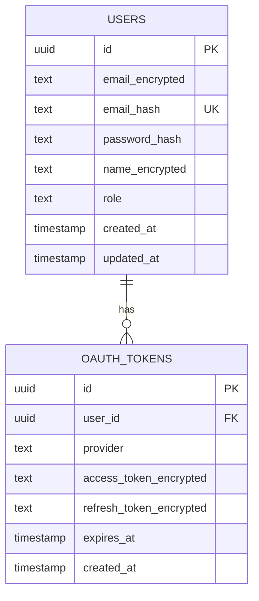

# Schema Documentation

Database schema definitions and documentation.

## Files

- **schema.sql** - Complete database schema (for reference)
- **erd.md** - Entity-Relationship diagram (Mermaid syntax)
- **tables.md** - Detailed table documentation

## Entity-Relationship Diagram (Coming Soon)

## Tables

### users

Stores user account information with encrypted PII.

| Column | Type | Constraints | Description |
|--------|------|-------------|-------------|
| id | UUID | PRIMARY KEY | User ID (auto-generated) |
| email_encrypted | TEXT | NOT NULL | Encrypted email address |
| email_hash | TEXT | UNIQUE NOT NULL | SHA-256 hash for email lookup |
| password_hash | TEXT | NOT NULL | Argon2id password hash |
| name_encrypted | TEXT | - | Encrypted user name |
| role | TEXT | DEFAULT 'user' | User role (user, admin) |
| created_at | TIMESTAMP | DEFAULT NOW() | Account creation time |
| updated_at | TIMESTAMP | DEFAULT NOW() | Last update time |

**Indexes:**
- PRIMARY KEY on `id`
- UNIQUE on `email_hash`

**Encryption:**
- `email_encrypted`: XChaCha20-Poly1305
- `name_encrypted`: XChaCha20-Poly1305
- `password_hash`: Argon2id (NOT encrypted!)

---

### oauth_tokens (Coming Soon)

Stores OAuth tokens for external providers (Google, GitHub, etc.)

| Column | Type | Constraints | Description |
|--------|------|-------------|-------------|
| id | UUID | PRIMARY KEY | Token ID |
| user_id | UUID | FOREIGN KEY | Reference to users.id |
| provider | TEXT | NOT NULL | OAuth provider (google, github) |
| access_token_encrypted | TEXT | NOT NULL | Encrypted access token |
| refresh_token_encrypted | TEXT | - | Encrypted refresh token |
| expires_at | TIMESTAMP | - | Token expiration time |
| created_at | TIMESTAMP | DEFAULT NOW() | Token creation time |

**Indexes:**
- PRIMARY KEY on `id`
- INDEX on `user_id`
- UNIQUE on `(user_id, provider)`

**Encryption:**
- `access_token_encrypted`: XChaCha20-Poly1305
- `refresh_token_encrypted`: XChaCha20-Poly1305

---

## See Also

- `Architecture/Backend/Data-Encryption-Strategy.md` - Encryption guidelines
- `Architecture/Types/User.md` - User type definitions (TODO)
